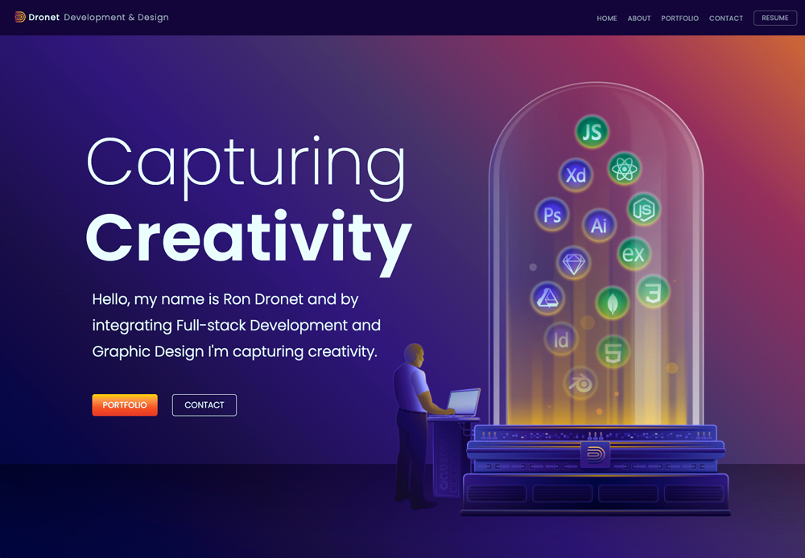

# Dronet Dev Design Portfolio Website
## Thank you for visiting my personal website!

## Purpose:

Welcome to my portfolio website that was created using REACT! Here you'll be able to navigate using the menu items About, Portfolio, Contact and Resume. The About page will give you a little insight as to who I am and what my goals are. The Portfolio page showcases four of my latest projects. Clicking the Contact menu item will open up an email window which makes it easy to contact me. Clicking the Resume menu item will open up a new browser window to reveal my current resume with details. Thank you for visiting my portfolio website! Please contact me if you any
questions.

 

## Deployed Website Link:
## https://dronetdevdesign.github.io/dronetdevdesign-app/

 

## **Table of contents:**

- [Installation](#installation)
- [Start](#start)
- [Usage](#usage)
- [Contribute](#contribute)
- [Questions](#questions)

 

     

 

## Viewable Responsive Screen Sizes:

* Desktop: 2000px
* Media Query Sizes:
  - 1200px to 992px (Desktop - laptops)
  - 768px (Laptop - tablets)
  - 576px (Small devices)
  - 430px (large cell phones)
  - 390px (small cell phones)

 

## This App Was Created Using:

  - HTML 
  - CSS
  - JavaScript
  - NodeJS
  - React
  - Git/GitHub
  - GoogleFonts
  - FontAwesome

 

## Graphic Software Used:
  - Adobe Photoshop
  - Adobe Illustrator
  - Adobe AfterEffects
  - Sketch

 

## Installation:

### To install all packages use this command in the the terminal:

`npm i`

 

## Start:

### To start use this command in the the terminal: 

`npm start`

 

## Usage:

### The respository can be cloned and placed in a folder remotely.

 

## Contribute:

### Please contact me regarding contributing to this repository. All additions must be approved.

 

## Questions?

### If you have any questions here's how to contact me:

- Username: DronetDevDesign
- Repository: https://github.com/DronetDevDesign
- Email: ron@DronetDevDesign.com

